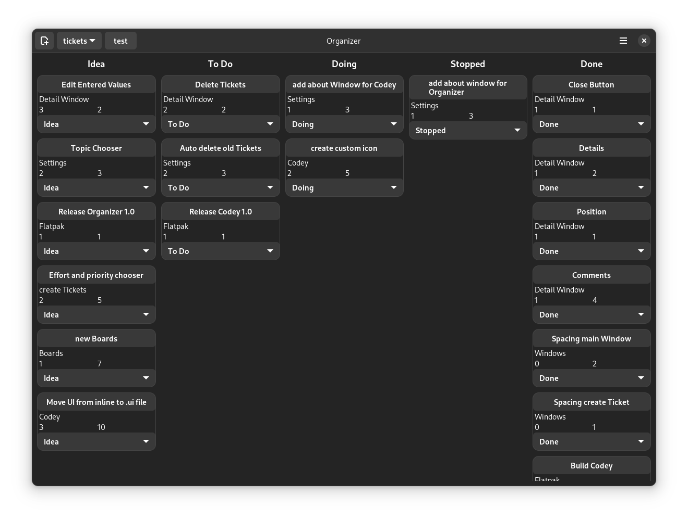
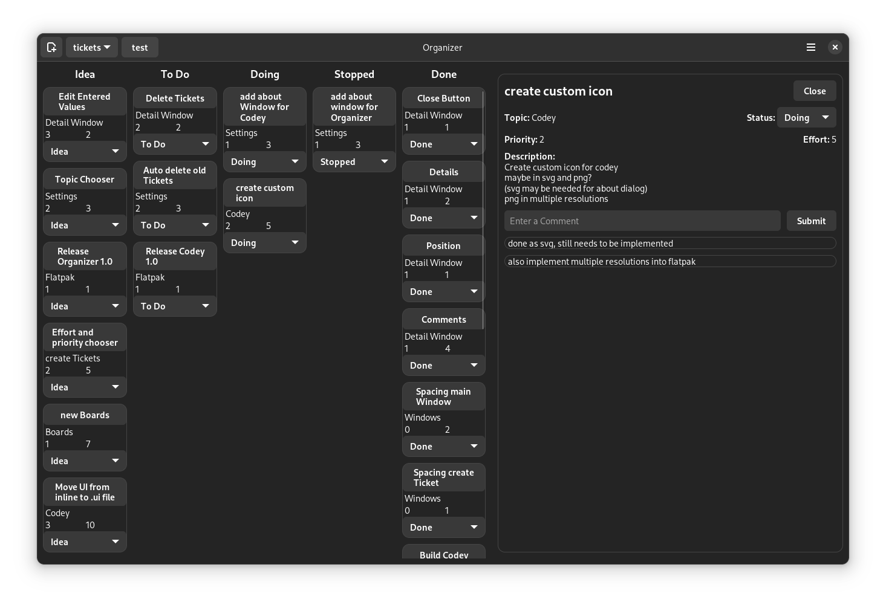

# Organizer

 

Organize your work in a local and agile kanban board, written with Python, Gtk 4 and Libadwaita.

Some important links: 
* View the sourcecode on [Github](https://github.com/UnicornyRainbow/Organizer) or [GitLab](https://gitlab.com/UnicornyRainbow/Organizer)
* Or [install](https://UnicornyRainbow.io/Organizer/install) Organizer.
* Take a look at my other [projects](https://UnicornyRainbow.github.io/UnicornyRainbow/myProjects)
